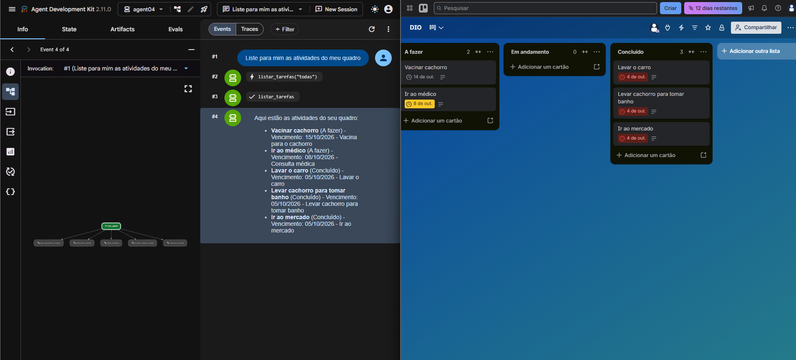
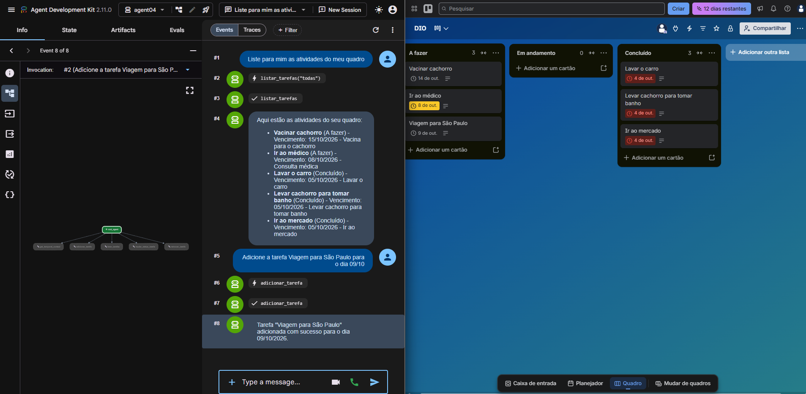
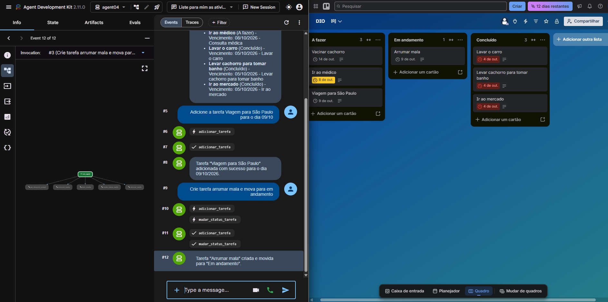
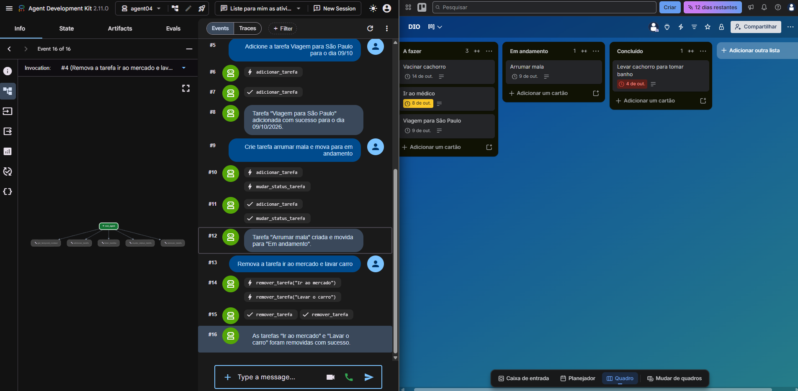
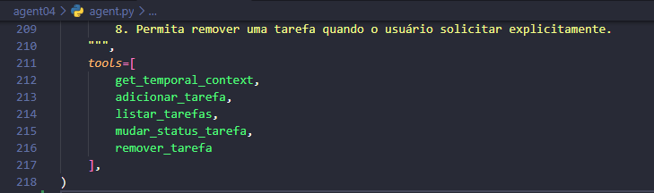

# Agente Trello com Google ADK

Projeto desenvolvido em Python para gerenciamento de tarefas no Trello utilizando **Google Agent Development Kit (ADK)**, **Gemini** e a **API do Trello**.

O agente permite criar, listar, alterar o status e remover tarefas por meio de linguagem natural.

## Sobre o desafio

Este projeto foi desenvolvido a partir de um desafio prático da **DIO**, cujo objetivo é construir um agente de IA capaz de organizar tarefas em um quadro do Trello a partir de uma conversa com o usuário.

O projeto utiliza funções Python como ferramentas (_tools_) que podem ser selecionadas pelo agente de acordo com a intenção identificada na conversa.

## Tecnologias utilizadas

- Python
- Google Agent Development Kit (ADK)
- Gemini
- Trello API
- py-trello
- python-dotenv
- ZoneInfo
- tzdata
- Git e GitHub

## Funcionalidades

O agente permite:

- Criar novas tarefas no Trello;
- Listar todas as tarefas cadastradas;
- Filtrar tarefas por status;
- Mover tarefas entre as listas:
  - A fazer
  - Em andamento
  - Concluído
- Remover tarefas do quadro;
- Utilizar linguagem natural para interagir com o Trello;
- Trabalhar com contexto de data e hora;
- Tratar o fuso horário utilizado nas datas das tarefas;
- Proteger credenciais utilizando variáveis de ambiente.

## Como funciona

O fluxo simplificado do agente é:

```text
Usuário
   ↓
Gemini
   ↓
Google ADK
   ↓
Ferramenta Python
   ↓
API do Trello
   ↓
Quadro
```

O Gemini interpreta a solicitação do usuário e o Google ADK identifica qual ferramenta Python deve ser executada.

As principais ferramentas implementadas são:

- `get_temporal_context()`: obtém a data e hora atual;
- `adicionar_tarefa()`: cria um novo cartão no Trello;
- `listar_tarefas()`: lista as tarefas cadastradas e permite filtragem por status;
- `mudar_status_tarefa()`: move uma tarefa entre as listas do quadro;
- `remover_tarefa()`: localiza e remove uma tarefa do Trello.

## Configuração do Trello

Para utilizar o agente, crie um quadro no Trello chamado:

`DIO`

O quadro deve possuir as seguintes listas:

- A fazer
- Em andamento
- Concluído

Também é necessário criar um aplicativo no portal de desenvolvedores do Trello para obter as credenciais utilizadas pela API:

- API Key;
- API Secret;
- Token de autenticação.

Essas informações devem ser armazenadas no arquivo `.env` e nunca adicionadas diretamente ao código-fonte.

## Configuração das credenciais

O projeto utiliza variáveis de ambiente para armazenar as credenciais do Gemini e do Trello.

Dentro da pasta `agent04`, crie um arquivo chamado `.env`.

Use o arquivo `.env.exemplo` disponível no repositório como referência:

```env
GOOGLE_API_KEY=SUA_CHAVE_GEMINI
TRELLO_API_KEY=SUA_CHAVE_TRELLO
TRELLO_API_SECRET=SEU_SEGREDO_TRELLO
TRELLO_TOKEN=SEU_TOKEN_TRELLO
```

Substitua os valores de exemplo pelas suas próprias credenciais.

O arquivo `.env` contém informações sensíveis e está incluído no `.gitignore`, portanto não deve ser enviado ao GitHub.

## Como executar o projeto

### 1. Clone o repositório

```bash
git clone https://github.com/marco-vilar/agente-trello-adk.git
```

Entre na pasta do projeto:

```bash
cd agente-trello-adk
```

### 2. Crie um ambiente virtual

```bash
python -m venv .venv
```

### 3. Ative o ambiente virtual

No Git Bash:

```bash
source .venv/Scripts/activate
```

No PowerShell:

```powershell
.venv\Scripts\Activate.ps1
```

### 4. Instale as dependências

```bash
python -m pip install -r requirements.txt
```

### 5. Configure as credenciais

Crie o arquivo:

```text
agent04/.env
```

Use o `.env.exemplo` como referência e informe suas próprias credenciais do Gemini e do Trello.

### 6. Execute o agente

```bash
adk web
```

O ADK exibirá no terminal o endereço local para acessar a interface web.

## Melhorias implementadas

Além da reprodução das funcionalidades do código-base, foram realizadas melhorias durante o desenvolvimento.

### 1. Correção de data e fuso horário no Trello

O código-base podia registrar uma tarefa no Trello com um dia de diferença em relação à data informada pelo usuário.

Isso ocorre porque o Trello trabalha com datas em UTC e a conversão de fuso horário pode alterar o dia exibido.

Foi implementado tratamento explícito utilizando:

```python
ZoneInfo("America/Sao_Paulo")
```

O fluxo passou a considerar:

```text
Data informada pelo usuário
        ↓
Horário de Brasília
        ↓
Conversão para UTC
        ↓
Envio para o Trello
```

Dessa forma, a data informada pelo usuário é enviada ao Trello de forma adequada, evitando o deslocamento para o dia anterior.

Também foi adicionada a dependência `tzdata`, garantindo o funcionamento das informações de fuso horário em ambientes Windows.

A função responsável pelo contexto temporal também passou a considerar explicitamente o horário de Brasília, sem depender apenas da configuração de horário do computador.

### 2. Otimização do uso das ferramentas do agente

As instruções do agente foram ajustadas para evitar chamadas desnecessárias às ferramentas e ao modelo de IA.

Entre as regras implementadas:

- ao listar tarefas, utilizar a ferramenta de listagem;
- ao adicionar uma tarefa, utilizar a ferramenta de criação;
- ao alterar um status, utilizar a ferramenta correspondente;
- consultar data e hora apenas quando necessário;
- evitar repetir uma ferramenta quando a informação já foi obtida;
- manter respostas mais objetivas.

Essa alteração torna o fluxo mais eficiente e reduz o consumo desnecessário de requisições ao modelo.

### 3. Utilização de modelo Flash-Lite

Durante os testes foram observadas instabilidades e indisponibilidade temporária em outros modelos Gemini.

O agente passou a utilizar um modelo **Flash-Lite**, adequado para tarefas mais simples de agentes e chamadas de ferramentas.

Essa escolha também contribui para reduzir o consumo de recursos durante os testes e a execução do projeto.

### 4. Proteção das credenciais

As credenciais utilizadas pelo Gemini e pelo Trello foram separadas do código-fonte.

O projeto utiliza:

- arquivo `.env` para armazenar as credenciais reais;
- arquivo `.env.exemplo` para documentar as variáveis necessárias;
- `.gitignore` para impedir o versionamento das credenciais;
- exclusão do ambiente virtual e arquivos temporários do Python do repositório.

Nenhuma chave, segredo ou token real é armazenado no repositório público.

### 5. Remoção de tarefas

Foi adicionada a ferramenta:

```python
remover_tarefa()
```

Ela permite excluir cartões do Trello diretamente por meio de linguagem natural.

Exemplo:

```text
Usuário:
Remova a tarefa "Ir ao mercado"

        ↓

Gemini interpreta a solicitação

        ↓

ADK chama remover_tarefa()

        ↓

Python procura o cartão no quadro

        ↓

API do Trello remove a tarefa
```

A função procura a tarefa pelo nome em todas as listas do quadro.

Caso encontre o cartão, ele é removido. Caso contrário, o agente informa que a tarefa não foi encontrada.

A ferramenta também possui tratamento de erros para evitar que uma falha da API interrompa a execução do agente.

## Estrutura do projeto

```text
agente-trello-adk/
│
├── agent04/
│   ├── __init__.py
│   ├── agent.py
│   ├── .env.exemplo
│   └── .gitignore
│
├── .gitignore
├── requirements.txt
└── README.md
```

## Principais arquivos

- `agent04/agent.py`: contém o agente, as ferramentas Python e a integração com o Trello;
- `agent04/.env.exemplo`: modelo das variáveis de ambiente necessárias;
- `agent04/.gitignore`: impede o versionamento das credenciais e arquivos internos do ADK;
- `requirements.txt`: contém as dependências Python utilizadas;
- `.gitignore`: impede o versionamento do ambiente virtual e arquivos temporários;
- `README.md`: documentação do projeto.

## Segurança

As credenciais utilizadas neste projeto não são armazenadas diretamente no código.

Arquivos contendo informações sensíveis, como:

```text
.env
```

são ignorados pelo Git.

Nunca publique:

- Gemini API Key;
- Trello API Key;
- Trello API Secret;
- Trello Token.

O arquivo `.env.exemplo` contém apenas valores fictícios e serve como referência para configuração.

## Resultado

Ao final do projeto, foi desenvolvido um agente capaz de interagir com um sistema externo real utilizando linguagem natural.

O projeto permitiu aplicar conceitos de:

- Agentes de IA;
- LLMs;
- Function Calling;
- Google ADK;
- Python;
- APIs;
- Autenticação;
- Variáveis de ambiente;
- Tratamento de datas e fusos horários;
- Integração entre sistemas;
- Git e GitHub.

## Testes realizados

O agente foi testado utilizando a interface `adk web` integrada a um quadro real do Trello.

Foram validados os seguintes cenários:

- listagem das tarefas cadastradas;
- criação de novas tarefas;
- registro correto da data de vencimento;
- movimentação entre A fazer, Em andamento e Concluído;
- execução de mais de uma ferramenta a partir de uma única solicitação;
- remoção de tarefas;
- integração entre Gemini, Google ADK, Python e API do Trello.

Após cada operação, o resultado foi conferido diretamente no quadro do Trello.

## Evidências de funcionamento

### Listagem das tarefas



### Criação de tarefa e correção de data



### Criação e movimentação entre listas



### Remoção de tarefas



### Ferramentas registradas no agente



## Repositório

Projeto disponível em:

https://github.com/marco-vilar/agente-trello-adk
